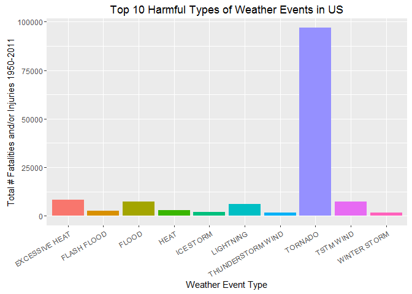
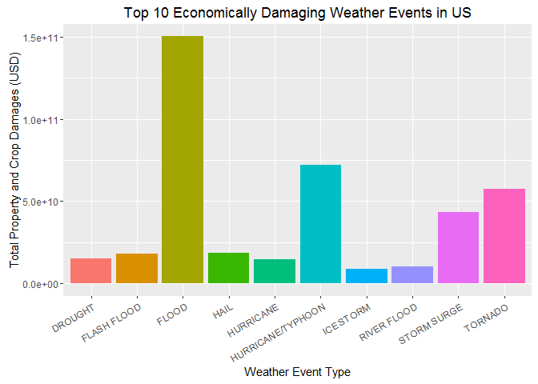

# RepData_HW2
Erin Stein  
December 14, 2016  


#Reproducible Data: Peer Assignment 2  
##Analyzing the impact of weather events on health and economy
  
###Synopsis

The NOAA maintains a storm database that tracks various characteristics of all major weather events in the US. We will utilize this database to determine the weather event type that is most harmful to people by analyzing the number of fatalities and injuries each causes, and to determine the type that is most damanging economically by analyzing the amount of property and crop damage each causes.

We must begin by processing the data-- limiting ourselves to the required information and cleaning it so that it's all in the same format. Then, we will order the data and provide visualizations to clearly determine which event type is the most harmful to people, and which is the most harmful to the economy.
  
***
  
###Installing libraries


```r
library(dplyr)
```

```
## Warning: package 'dplyr' was built under R version 3.3.2
```

```
## 
## Attaching package: 'dplyr'
```

```
## The following objects are masked from 'package:stats':
## 
##     filter, lag
```

```
## The following objects are masked from 'package:base':
## 
##     intersect, setdiff, setequal, union
```

```r
library(ggplot2)
```
  
***
  
###Data Processing

The data is in .csv.bz2 format, which can be read into r using a simple call to read.csv() .
  

```r
fileURL <- "https://d396qusza40orc.cloudfront.net/repdata%2Fdata%2FStormData.csv.bz2"
download.file(fileURL, destfile = "./weather.csv")
weather <- read.csv("weather.csv")
datedownloaded <- date()
```
  
The file is extremely large. We can reduce this by creating a new dataframe, weatherdf, that selects only the columns including info on date, time, event type, fatalities, injuries, property damange, and crop damage.
  

```r
weatherdf <- select(weather, c(2, 3, 8, 23:28))
```
  
Now, group the data by event type and create a dataframe that summarizes the total number of fatalities and the total number of injuries per weather event in order to analyze the effects on population health.
  

```r
events <- group_by(weatherdf, EVTYPE)
health <- summarise(events, Total.Fatalities = sum(FATALITIES), Total.Injuries = sum(INJURIES))
head(health)
```

```
## # A tibble: 6 × 3
##                  EVTYPE Total.Fatalities Total.Injuries
##                  <fctr>            <dbl>          <dbl>
## 1    HIGH SURF ADVISORY                0              0
## 2         COASTAL FLOOD                0              0
## 3           FLASH FLOOD                0              0
## 4             LIGHTNING                0              0
## 5             TSTM WIND                0              0
## 6       TSTM WIND (G45)                0              0
```
  
Since we are not prompted to weigh fatalities and injuries differently, let's create a new column that provides the total number of fatalities and/or injuries per weather event type to determine which are most harmful with respect to population health based on the given data. Then, rearrange the dataframe in descending order based on this new column.
  

```r
health <- mutate(health, Total = Total.Fatalities + Total.Injuries)
health <- arrange(health, desc(Total))
head(health)
```

```
## # A tibble: 6 × 4
##           EVTYPE Total.Fatalities Total.Injuries Total
##           <fctr>            <dbl>          <dbl> <dbl>
## 1        TORNADO             5633          91346 96979
## 2 EXCESSIVE HEAT             1903           6525  8428
## 3      TSTM WIND              504           6957  7461
## 4          FLOOD              470           6789  7259
## 5      LIGHTNING              816           5230  6046
## 6           HEAT              937           2100  3037
```
  
Let's now prepare the data that will help us determine each weather event's economic impact, using the slimmed-down weatherdf dataframe. The two variables we're provided are the amount of reported property damage and the amount of reported crop damage in dollars. These are each scaled by a separate column that requires some conversion. Broadly speaking, this scalar column provides the power of 10 by which to multiply the damage column. However, [Bb], [Hh], [Mm], [Kk] and missing values must be converted to 9, 2, 6, 3, and 0, respectively.
  

```r
econ <- select(weatherdf, c(3, 6:9))

##First convert the Property Damage's Scalar column.

table(econ$PROPDMGEXP)
```

```
## 
##             -      ?      +      0      1      2      3      4      5 
## 465934      1      8      5    216     25     13      4      4     28 
##      6      7      8      B      h      H      K      m      M 
##      4      5      1     40      1      6 424665      7  11330
```

```r
econ$PROPDMGEXP <- as.character(econ$PROPDMGEXP)
econ2 <- within(econ, PROPDMGEXP[PROPDMGEXP == "B"] <- rep(9, times = 40))
econ2 <- within(econ2, PROPDMGEXP[PROPDMGEXP == "h"] <- 2)
econ2 <- within(econ2, PROPDMGEXP[PROPDMGEXP == "H"] <- rep(2, times = 6))
econ2 <- within(econ2, PROPDMGEXP[PROPDMGEXP == "K"] <- rep(3, times = 424665))
econ2 <- within(econ2, PROPDMGEXP[PROPDMGEXP == "m"] <- rep(6, times = 7))
econ2 <- within(econ2, PROPDMGEXP[PROPDMGEXP == "M"] <- rep(6, times = 11330))
econ2 <- within(econ2, PROPDMGEXP[PROPDMGEXP == ""] <- rep(0, times = 465934))
econ2 <- within(econ2, PROPDMGEXP[PROPDMGEXP == "-"] <- 0)
econ2 <- within(econ2, PROPDMGEXP[PROPDMGEXP == "?"] <- rep(0, times = 8))
econ2 <- within(econ2, PROPDMGEXP[PROPDMGEXP == "+"] <- rep(0, times = 5))
econ2$PROPDMGEXP <- as.numeric(econ2$PROPDMGEXP)
econ2 <- mutate(econ2, Property.Damage = PROPDMG * 10 ** PROPDMGEXP)

##Second, convert the Property Damage's scalar column.

table(econ2$CROPDMGEXP)
```

```
## 
##             ?      0      2      B      k      K      m      M 
## 618413      7     19      1      9     21 281832      1   1994
```

```r
econ2$CROPDMGEXP <- as.character(econ2$CROPDMGEXP)
econ2 <- within(econ2, CROPDMGEXP[CROPDMGEXP == ""] <- rep(0, times = 618413))
econ2 <- within(econ2, CROPDMGEXP[CROPDMGEXP == "?"] <- rep(0, times = 7))
econ2 <- within(econ2, CROPDMGEXP[CROPDMGEXP == "B"] <- rep(9, times = 9))
econ2 <- within(econ2, CROPDMGEXP[CROPDMGEXP == "k"] <- rep(3, times = 21))
econ2 <- within(econ2, CROPDMGEXP[CROPDMGEXP == "K"] <- rep(3, times = 281832))
econ2 <- within(econ2, CROPDMGEXP[CROPDMGEXP == "m"] <- rep(6, times = 1))
econ2 <- within(econ2, CROPDMGEXP[CROPDMGEXP == "M"] <- rep(6, times = 1994))
econ2$CROPDMGEXP <- as.numeric(econ2$CROPDMGEXP)
econ2 <- mutate(econ2, Crop.Damage = CROPDMG * 10 ** CROPDMGEXP)
econtotal <- select(econ2, c(1, 6, 7))
head(econtotal)
```

```
##    EVTYPE Property.Damage Crop.Damage
## 1 TORNADO           25000           0
## 2 TORNADO            2500           0
## 3 TORNADO           25000           0
## 4 TORNADO            2500           0
## 5 TORNADO            2500           0
## 6 TORNADO            2500           0
```

```r
## Finally, add a column that sums the total damage in USD inflicted per event.

econtotal <- mutate(econtotal, Total.Damage = Property.Damage + Crop.Damage)
econtotal <- arrange(econtotal, desc(Total.Damage))
```
  
Now that the total economic damage per event has been calculated, it's time to group the data by event type in order to sum all of the economic damage inflicted by each type of weather event.
  

```r
econtotal <- group_by(econtotal, EVTYPE)
econtotalsum <- summarise(econtotal, Sum.of.Damages = sum(Total.Damage))
econtotalsum <- arrange(econtotalsum, desc(Sum.of.Damages))
head(econtotalsum)
```

```
## # A tibble: 6 × 2
##              EVTYPE Sum.of.Damages
##              <fctr>          <dbl>
## 1             FLOOD   150319678257
## 2 HURRICANE/TYPHOON    71913712800
## 3           TORNADO    57362333947
## 4       STORM SURGE    43323541000
## 5              HAIL    18761221986
## 6       FLASH FLOOD    18243991079
```
  
***
  
###Results
  
The data has been prepared in order to accurately assess the impact in the US of each type of weather event within the restrictions of given data set.
  
1. Impact on Health
  
Looking at the head of the health data frame produced in the Preprocessing step, we see:
  

```r
head(health)
```

```
## # A tibble: 6 × 4
##           EVTYPE Total.Fatalities Total.Injuries Total
##           <fctr>            <dbl>          <dbl> <dbl>
## 1        TORNADO             5633          91346 96979
## 2 EXCESSIVE HEAT             1903           6525  8428
## 3      TSTM WIND              504           6957  7461
## 4          FLOOD              470           6789  7259
## 5      LIGHTNING              816           5230  6046
## 6           HEAT              937           2100  3037
```
  
Thus, **tornados** are most harmful with respect to human health as it has a total of 96,979 fatalities and injuries, followed second by excessive heat, which totals 8,428.
  
Since there are so many different types of weather events, let's visualize this by just looking at the events with the top 10 number of fatalities and/or injuries:
  

```r
healthhead <- head(health, 10)

ggplot(data = healthhead, aes(x = EVTYPE, y = Total)) + 
        geom_bar(stat = "identity", show.legend = FALSE) + 
        theme(axis.text.x=element_text(angle=30, hjust = 1, vjust = 1)) + 
        labs(title = "Top 10 Harmful Types of Weather Events in US", 
             x = "Weather Event Type", 
             y = "Total # Fatalities and/or Injuries 1950-2011") + 
        aes(fill = EVTYPE)
```

<!-- -->
  
2. Impact on Economy
  
Looking at the head of the health data frame produced in the Preprocessing step, we see:
  

```r
head(econtotalsum)
```

```
## # A tibble: 6 × 2
##              EVTYPE Sum.of.Damages
##              <fctr>          <dbl>
## 1             FLOOD   150319678257
## 2 HURRICANE/TYPHOON    71913712800
## 3           TORNADO    57362333947
## 4       STORM SURGE    43323541000
## 5              HAIL    18761221986
## 6       FLASH FLOOD    18243991079
```
  
Thus, **floods** are most damaging to the economy as they caused a total of $150.3 billion in property and crop damages from 1950-2011, followed second by excessive hurricanes and typhoons, which totaled $71.9 billion in property and crop damages.
  
Since there are so many different types of weather events, let's visualize this by just looking at the events with the top 10 totals in property and crop damages:
  

```r
econhead <- head(econtotalsum, 10)

ggplot(data = econhead, aes(x = EVTYPE, y = Sum.of.Damages)) + 
        geom_bar(stat = "identity", show.legend = FALSE) +
        theme(axis.text.x=element_text(angle=30, hjust = 1, vjust = 1)) +
        labs(title = "Top 10 Economically Damaging Weather Events in US",
             x = "Weather Event Type",
             y = "Total Property and Crop Damages (USD)") +
aes(fill = EVTYPE)
```

<!-- -->

